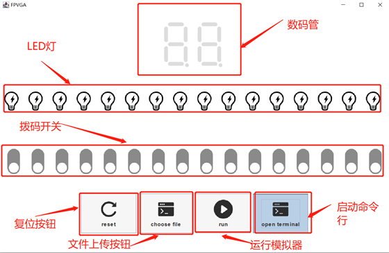

# NetDesign

## Task1

基于WinPcap的ICMP发送接收程序，需使用Visual Studio运行

#### ICMPSender：

- 发送ICMP echo request报文。
- 运行前需要填写：源/目的主机MAC/IP地址

#### ICMPReceiver：

- 接收、解析并保存ICMP echo request报文。
- 运行前需填写：目的主机IP地址。
- 解析后的ICMP echo request报文自动保存在目录下的`xxHxxMxxS`文件下。文件名表示捕获报文的时间

## Task2

基于socket的C/S应用，实现简单远程程序调用，并扩展成一个云端FPGA模拟器：将verilog文件发送给服务器编译，并发送时钟、复位信号、开关状态，接收数码管和LED状态，并解析到客户端GUI显示。

#### Client：

- Java语言编写，可以实现跨平台，运行于任何操作系统

- 运行前需填写：Server的IP及端口号

- Swing实现GUI：

  - 

  - `open terminal`按钮用于启动命令行，实现最基本的远程程序调用
    - 支持`ifconfig/ping/gcc -v`等简单命令

  - `choose file`按钮用于上传verilog文件，服务器将返回文件编译结果
  - `run`运行模拟器
  - `reset`复位按钮
  - 开关、LED、数码管：客户端可接收数码管和LED状态，并解析到GUI显示

- demo文件夹下给出了四个verilog文件示例

#### Server：

- Task2\linux_server文件夹下，执行`make run`启动服务器
- C++编写，Makefile脚本编译，可运行于Linux操作系统

- 最多支持五个Client同时连接
- 执行用户命令并将结果返回，将`stderr`重定向到`stdout`，错误信息也会发送给客户端
- 接收并编译verilog文件
- 接收时钟、复位信号、开关状态，运行verilog文件，执行结果发送给客户端

