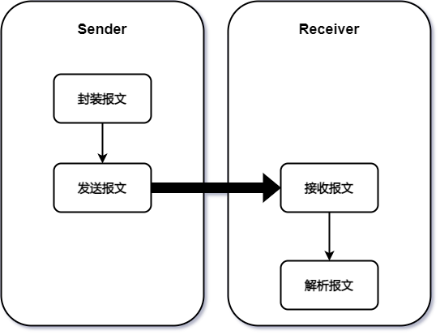

**实验名称：**计算机网络课程设计

**实验目的：**

​	将书本上抽象的概念与具体实现技术结合，通过网络软件编程的实践，深入理解理论课上学习到的计算机网络基本原理和重要协议，通过自己动手编程封装与发送数据分组，加深对网络协议的理解，掌握协议数据单元的结构和协议工作原理及其对协议栈的贡献。

**实验仪器：**

实验硬件设备：`（用到的计算机和网络设备）`


实验软件要求：`（使用的操作系统、开发工具和编程语言）`

操作系统：windows10、Ubuntu

开发工具：VisualStudio2019、IDEA

编程语言：C/C++、Java

任务分工情况：

王浩宇：

张子卿：


**实验原理：**

题目1实验原理：

​	数据包的封装发送和解析（ARP/ICMP/TCP），网络协议栈的多种协议都有自己的功能，协议包括语义、语法和同步三个要素，不同的网络协议其分组的首部格式不同，必须按照协议规定的格式封装（发送）和理解（接收）数据分组首部，才能使得不同站点的计算机按照规定的方式相互通信。ARP协议是IP地址和MAC地址解析协议；ICMP是控制IP数据包传递的协议；TCP是面向连接的可靠的传输层协议，它们均有自己固定的分组首部格式。

​	本实验中使用WinPcap技术或Socket技术，根据ARP/ICMP/TCP协议数据单元的结构和封装规则，封装数据帧发送到局域网中。另外要捕获网络中的ARP/ICMP/TCP数据包，解析数据包的内容，并显示结果，同时写入日志文件。  

题目2实验原理：`（200~300字）`

​	Socket编程技术，是计算机网络编程的基石。一个Socket由一个三元组构成，包括IP地址，协议，端口号三个部分，抽象的描述了计算机网络通信的一个端点。Socket编程技术。

**实验内容与步骤：**

**题目1：数据分组的发送和解析（ARP/ICMP/TCP）**

（1）需求分析

`（根据任务的描述，明确要实现的功能）`

​	通过winpcap等库，在一台计算机（Sender）上编写代码，定义ICMP、IP、以太网帧首部结构体，并利用构建的结构体封装ICMP的echo request报文，将报文发送给另一台计算机（Receiver）；Receiver需要编写程序，接收Sender发出的ICMP报文，对报文内容进行解析，并将解析结果输出到日志文件中。

（2）设计方案

`（程序功能模块的划分、模块间的联系、数据结构和关键问题的解决方法等，可结合图表说明）`

​	整个任务可分为两个部分：发送ICMP echo request的Sender，接收并解析ICMP echo request的Receiver。两者的主要功能模块及其之间的联系可用下图表示：



​	在各模块具体的设计过程中，也需要注意以下几个关键问题：

**结构体定义**

​	由于winpcap需要到数据链路层进行数据的传输，无论是Sender还是Receiver都需要定义ICMP、IP、以太网帧的首部结构体。定义首部结构体时需要注意，结构体中各成员占用的空间大小必须与首部中各字段的大小相互对应。一种便捷的方式是使用C语言的位域，在定义成员时指定其位数。例如定义IP报文首部：

```C++
//IP报文首部
typedef struct ip_header {
	unsigned int version_head_len : 8;	//版本_首部长(4B为单位)
	unsigned int tos : 8;				//服务
	unsigned int len : 16;				//IP报文总长(1B为单位)
	unsigned int identification : 16;	//标识
	unsigned int flag_offset : 16;		//标志_片偏移
	unsigned int ttl : 8;				//生存时间
	unsigned int proto : 8;				//协议，ICMP为1
	unsigned int checksum : 16;			//首部校验和
	ip_address saddr;					//源IP
	ip_address daddr;					//目的IP
} ip_header;
```

**报文构造**

​	报文的内容可以参照ping命令产生的echo request报文，只需要改变IP、MAC、校验和等信息

**数据大小端**

​	  计算机中一般采用小端模式存储数据，而网络中规定高位字节优先存储的网络字节顺序，即大端模式。因此必须对多字节数据进行大小端转换，可以通过函数：htons(u_short)/htonl(u_long)实现。例如，设置IP首部长度为2B的标识字段值为0x1f78：

```c++
ih->identification = htons(0x1f78);	//标识
```

**如何测试**

​	本任务涉及到两个程序（Sender/Receiver），为了方便测试、提高测试效率，可以对两个程序分别测试。详见*<u>测试方案</u>*部分

（3）程序结构和流程图


（4）测试方案

​	测试主要包含两部分：对计算校验和的检验、对Sender/Receiver程序功能的检验

**计算校验和检验**

​	校验和不正确的报文会在转发过程中被丢弃，因此计算校验和是保证之后Sender/Receiver程序功能检验的前提。我们采用的方式是构造一个与已有的报文完全相同的报文（除校验和置为0），然后计算校验和，对比结果。显然，如果校验和一致，说明该部分代码没有问题，可以进行下一步测试。

**Sender/Receiver程序功能测试**

​	Sender和Receiver两个程序耦合性较低，可以先通过wireshark分别测试两者的功能，再将二者连接起来，同时测试整个程序的功能。

​	对于Sender，向任意IP发送ICMP，wireshark如果能抓取Sender发出的报文，说明报文内容是合法的；对于Receiver，如果抓取的ICMP报文与wireshark一致，说明Receiver功能是正常的。之后将二者连接，Sender向Receiver发送ICMP，为了验证报文的正确性，还应通过wireshark软件进行验证：Receiver接收的报文是否与wireshark一致；Sender的wireshark是否接收到Receiver发出的echo reply报文。

**题目2：简单远程程序调用**

> 设计目的：
>
> - 设计并实现一个C/S应用，客户端接收用户从键盘输入的命令，并发送给服务器，服务器端执行该命令，并将命令的执行结果返回给客户端，客户端显示命令执行结果。类似Telnet应用
>
> 设计要求：
>
> - 以命令行或图形界面形式运行程序
> - 使用Socket API或Winpcap技术
> - 如果服务器端无法识别该命令，给出错误提示
>
> 其他：
>
> - 不必完全按照要求设计，可以适当简化或扩展

（1）需求分析

`（根据任务的描述，明确要实现的功能）`

a）基本需求分析

实现一个C/S应用，需要设计Client端应用和Server端应用，Client端需要能够接收用户的命令，然后将命令发送至服务器端；Server端需要能够接受Client发送来的命令，并且执行这些命令获得返回结果，并将结果发送给Client端。Client端为了接收用户命令，需要有个简单的Terminal用于输入指令。

b）扩展实现分析

在基本需求实现的前提下，可以通过自己设计一个Server端运行的程序，Client端通过Server对该程序进行控制，从而实现一些特殊的功能。在我们的设计中，我们计划实现一个云端FPGA模拟器，用户可以发送Verilog文件交由模拟器执行，同时用户可以通过一些可视化的方式，与FPGA模拟器进行交互。为了实现这部分功能，需要完成以下几个部分：定义模拟器与Client交互的控制字格式，实现文件的上传功能，为Client端实现一个图形化界面。

（2）设计方案

`（程序功能模块的划分、模块间的联系、数据结构和关键问题的解决方法等，可结合图表说明）`

a）设计思路

整个程序的处理内容事实上可以归纳为对数据和指令的处理。对于FPGA模拟器的控制事实上也是通过一些Server端自定义的命令来实现的。Server与Client约定了某些特殊命令，当Client端有相应的事件触发时，就会向Server端发送对应的保留命令，从而使Server端进入对应的处理状态。数据包括一般命令数据和FPGA模拟器数据。对FPGA模拟器的实现，本质上是C/S两端对于FPGA模拟器状态数据的修改和同步。C/S两端各自维护一个自己的FPGA状态，当自己的状态因为用户事件或是模拟器计算发生改变时，就会对状态进行同步。

Client与Server端的交互采用Socket通信，Client与Server端有一个基本的约定：Client端每进行一次发送，就需要收到一个响应；Server端每进行一次接收，必须返回一个结果。为了维持服务端与客户端数据和命令的控制关系，我们采用了阻塞IO的方式，确保服务端和客户端的行为满足时序约束。

b）整体架构

整个程序整体上由客户端和服务器端两大部分构成。客户端可以划分为GUI和Client两个部分。服务器端可以划分为Server和Vmodel（Virtual FPGA Model）两个部分。其大致关系如下图所示：


前端的GUI主要负责处理用户对于FPGA模拟器的操作，将其转化为数据交给数据处理发送单元，同时GUI会根据Client提供的数据更新当前的显示状态，为了满足模拟一块真实的FPGA开发板的需要，GUI中实现了16个LED灯，2个数码管，16个拨码开关，以及1个复位按钮。除此之外，GUI中还提供了运行按钮，用于控制FPGA模拟器的启动与关闭；上传按钮，用于发送用户指定Verilog文件；Terminal按钮，用于开启命令行交互。


GUI的实现采用了Swing来实现，在整个Client程序运行之初，会先利用Swing库中的相关API绘制图形化界面，在界面上绘制各类按钮，开关，LED灯等元素，并为可交互的组件如各类按钮加入事件监听器，当事件触发时，便调用相应的函数，执行相应的命令。

Client单元一方面负责命令、数据的处理和发送，另一方面也负责接受Server端的数据接收与解析。Client处理的命令是多样的，命令的来源包括GUI上的一些按键，也包括terminal的输入。对于命令，由于命令往往是多行的，Client会选择直接调用Java Socket接口函数将命令发送至Server端。当Client需要发送多行数据时，例如上传文件，为了标识数据流的终结，需要发送一个“EREQ”的终结标识符。对于多行输入来说，一个EREQ标识着一次发送的结束。

服务器端的Server部分，首先需要负责监听客户端的请求，每建立一个连接，就开启一个新的线程去处理该连接的请求。当前最多支持五个客户端同时访问。其次，线程处理函数对Client发送来的请求进行解析，然后转发至响应的处理程序。对于普通bash命令，服务器端会调用bash来执行该命令获取结果，对于我们约定的启动fpga的命令，则会通过创建新进程的方式调用服务器端编译的FPGA模拟器。上传文件只需要单纯的文件读取，所以不需要采用多线程或多进程的方式进行处理。Server端向Client写回数据同样也需要考虑数据的格式，单行数据来说，只需要直接发送即可。对于多行数据，同样需要为指定一个结束标识符，也就是ERESP。

模拟器Vmodel的部分采用了开源模拟器Verilator，这是一款针对System Verilog HDL的模拟器，可以将System Verilog的代码编译成C++文件，通过与我们写好的C++文件（称为激励产生模块文件）共同编译链接，就可以形成一个可交互的FPGA模型Vmodel。激励产生模块一方面通过对Verilator 模型的输入输出状态进行写入和读取，仿真程序的状态，另一方面，激励产生模块还需要与Server程序进行进程间通信（IPC），进程间通信采用Linux的系统调用，通过两个有名管道在Server端进行数据交换。

（3）程序结构和流程图


（4）测试方案


**实验数据：**

`（包括输入数据和预期的输出数据，实际输出数据在“实验结果与分析”中描述）`


**实验结果与分析：**

`（详细的实验结果，图/表/文相结合，并对实验结果进行较全面的对比分析，类似于“**验证问题**”）` 

 

（1）程序运行结果

`（详细的实验结果：程序实际输出的数据及其他内容，图/表/文结合）`


（2）运行结果分析

`（图/表/文相结合，对实验结果进行较全面的对比分析，如有重要的数据分组，在此进行字段分析）`


（3）实验结论

`（本次课设的学习体会收获，对应前面的实验目的）`


（4）讨论

`（存在的问题及可能的改进方向）` 


**重要程序代码：**

`（重要代码，要加上注释）` 


 