**实验名称：**计算机网络课程设计

**实验目的：**

将书本上抽象的概念与具体实现技术结合，通过网络软件编程的实践，深入理解理论课上学习到的计算机网络基本原理和重要协议，通过自己动手编程封装与发送数据分组，加深对网络协议的理解，掌握协议数据单元的结构和协议工作原理及其对协议栈的贡献。

**实验仪器：**

实验硬件设备：

Laptop两台、Linux虚拟机一台、手机（热点）一台

实验软件要求：

操作系统：windows10、Ubuntu

开发工具：VisualStudio2019、IDEA

编程语言：C/C++、Java

任务分工情况：

王浩宇：


张子卿：


**实验原理：**

题目1实验原理：

数据包的封装发送和解析（ARP/ICMP/TCP），网络协议栈的多种协议都有自己的功能，协议包括语义、语法和同步三个要素，不同的网络协议其分组的首部格式不同，必须按照协议规定的格式封装（发送）和理解（接收）数据分组首部，才能使得不同站点的计算机按照规定的方式相互通信。ARP协议是IP地址和MAC地址解析协议；ICMP是控制IP数据包传递的协议；TCP是面向连接的可靠的传输层协议，它们均有自己固定的分组首部格式。

本实验中使用WinPcap技术或Socket技术，根据ARP/ICMP/TCP协议数据单元的结构和封装规则，封装数据帧发送到局域网中。另外要捕获网络中的ARP/ICMP/TCP数据包，解析数据包的内容，并显示结果，同时写入日志文件。  

题目2实验原理：

Socket编程技术，是计算机网络编程的基石。一个Socket由一个三元组构成，包括IP地址，协议，端口号三个部分，抽象的描述了计算机网络通信的一个端点。通过Socket技术，通过Socket，网络中的计算机的特定进程可以相互之间建立连接进行通信。

套接字本身也是一种IPC(InterProcess Communication, 进程间通信)，进程通过访问套接字访问其他进程，无所谓该进程位于同一台计算机或是不同的计算机。Socket本身支持多种不同的协议相互连接，在本次实验采用的是TCP/IP协议族中的TCP协议。

**实验内容与步骤：**

**题目1：数据分组的发送和解析（ARP/ICMP/TCP）**

（1）需求分析

通过winpcap等库，在一台计算机（Sender）上编写代码，定义ICMP、IP、以太网帧首部结构体，并利用构建的结构体封装ICMP的echo request报文，将报文发送给另一台计算机（Receiver）；Receiver需要编写程序，接收Sender发出的ICMP报文，对报文内容进行解析，并将解析结果输出到日志文件中。

（2）设计方案

整个任务可分为两个部分：发送ICMP echo request的Sender，接收并解析ICMP echo request的Receiver。两者的主要功能模块及其之间的联系可用下图表示：


在各模块具体的设计过程中，也需要注意以下几个关键问题：

**结构体定义**

由于winpcap需要到数据链路层进行数据的传输，无论是Sender还是Receiver都需要定义ICMP、IP、以太网帧的首部结构体。定义首部结构体时需要注意，结构体中各成员占用的空间大小必须与首部中各字段的大小相互对应。一种便捷的方式是使用C语言的位域，在定义成员时指定其位数。例如定义IP报文首部：

```C++
//IP报文首部
typedef struct ip_header {
	unsigned int version_head_len : 8;	//版本_首部长(4B为单位)
	unsigned int tos : 8;				//服务
	unsigned int len : 16;				//IP报文总长(1B为单位)
	unsigned int identification : 16;	//标识
	unsigned int flag_offset : 16;		//标志_片偏移
	unsigned int ttl : 8;				//生存时间
	unsigned int proto : 8;				//协议，ICMP为1
	unsigned int checksum : 16;			//首部校验和
	ip_address saddr;					//源IP
	ip_address daddr;					//目的IP
} ip_header;
```

**报文构造**

报文的内容可以参照ping命令产生的echo request报文，只需要改变IP、MAC、校验和等信息

**数据大小端**

计算机中一般采用小端模式存储数据，而网络中规定高位字节优先存储的网络字节顺序，即大端模式。因此必须对多字节数据进行大小端转换，可以通过函数：htons(u_short)/htonl(u_long)实现。例如，设置IP首部长度为2B的标识字段值为0x1f78：

```c++
ih->identification = htons(0x1f78);	//标识
```

**如何测试**

本任务涉及到两个程序（Sender/Receiver），为了方便测试、提高测试效率，可以对两个程序分别测试。详见*<u>测试方案</u>*部分

（3）程序结构和流程图

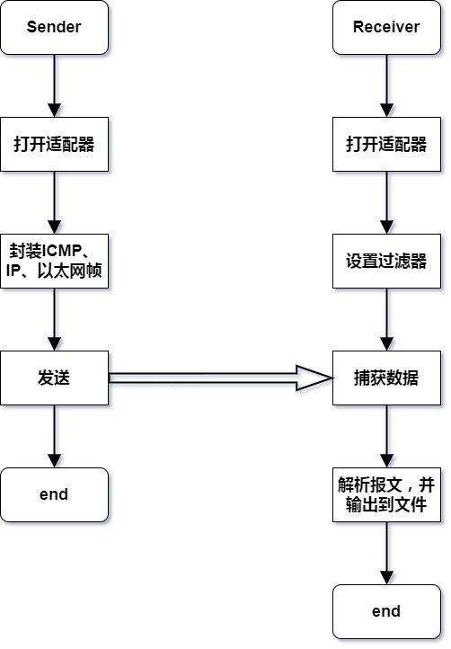

（4）测试方案

测试主要包含两部分：对计算校验和的检验、对Sender/Receiver程序功能的检验

**计算校验和检验**

校验和不正确的报文会在转发过程中被丢弃，因此计算校验和是保证之后Sender/Receiver程序功能检验的前提。我们采用的方式是构造一个与已有的报文完全相同的报文（除校验和置为0），然后计算校验和，对比结果。显然，如果校验和一致，说明该部分代码没有问题，可以进行下一步测试。

**Sender/Receiver程序功能测试**

Sender和Receiver两个程序耦合性较低，可以先通过wireshark分别测试两者的功能，再将二者连接起来，同时测试整个程序的功能。对于Sender，向任意IP发送ICMP，wireshark如果能抓取Sender发出的报文，说明报文内容是合法的；对于Receiver，如果抓取的ICMP报文与wireshark一致，说明Receiver功能是正常的。之后将二者连接，从Sender向Receiver发送ICMP，为了验证报文的正确性，还应通过wireshark软件进行验证：Receiver接收的报文是否与wireshark一致；Sender的wireshark是否接收到Receiver发出的echo reply报文。

**实验数据：**

输入：

Sender向Receiver发送数据ICMP echo requset（为方便查看，使用wireshark抓包，经验证与实际填写的内容一致）：

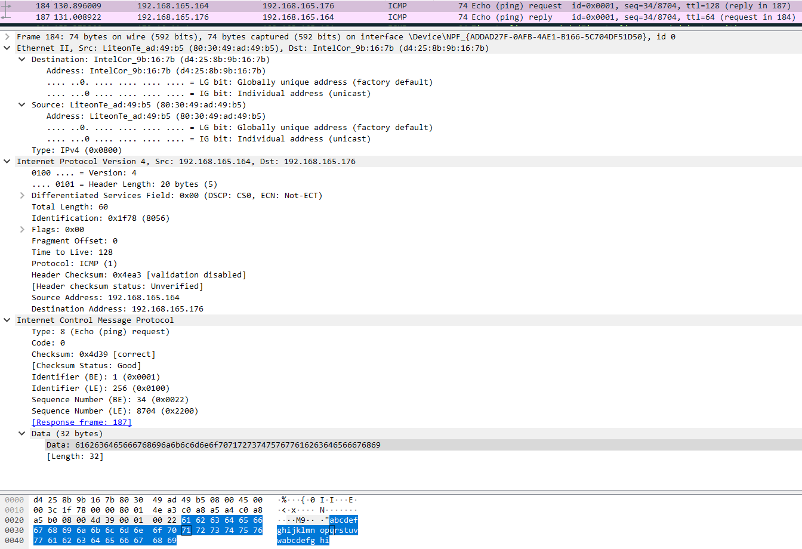

其中几个关键的字段：源主机IP192.168.165.164（c0 a8 a5 a4），目的主机IP192.168.165.176（c0 a8 a5 b0），ICMP类型字段为8（echo request），数据部分为abcdefghijklmnopqrstuvwabcdefghi。

期待的输出：

1.Receiver应可以接收并解析Sender的报文，同时wireshark也应抓到对应报文，二者应完全一致

2.Sender应可以通过wireshar接收到Receiver自动回复的echo reply报文

**实验结果与分析：**

（1）程序运行结果


1.Receiver实际接收数据，与wireshark抓包对比

实际接收数据：

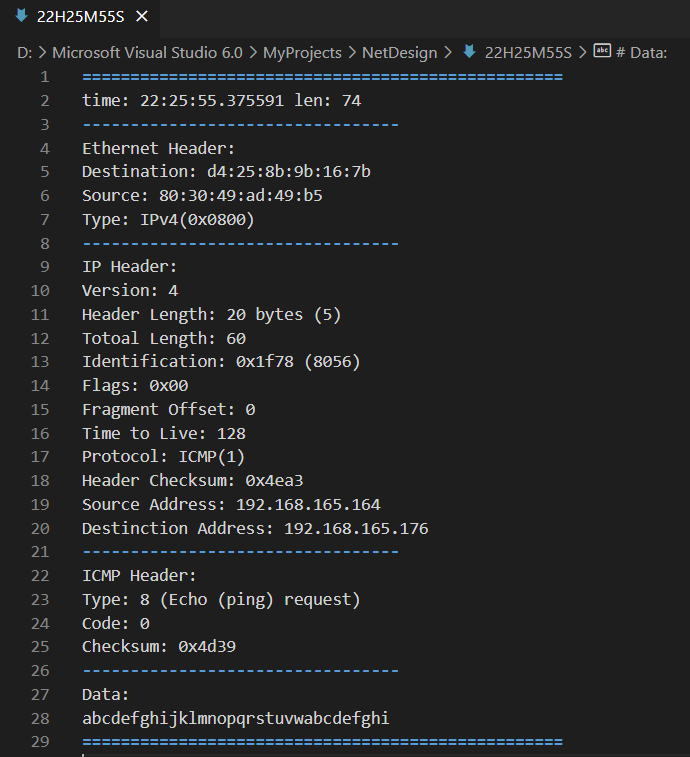

wireshark抓包：

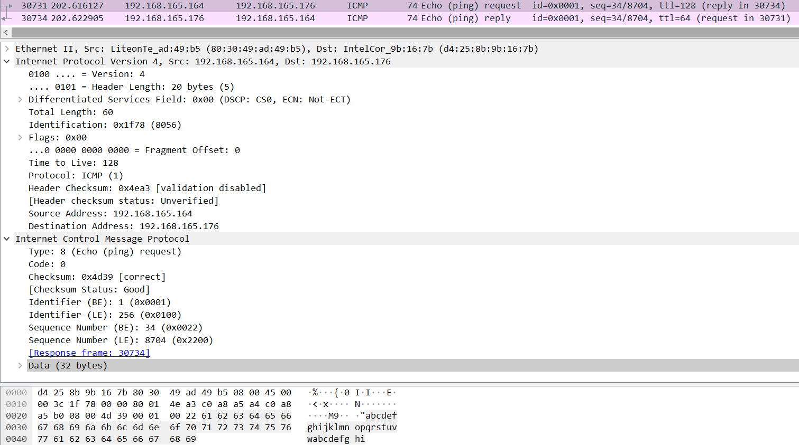

2.Sender通过wireshar接收到Receiver自动回复的echo reply报文

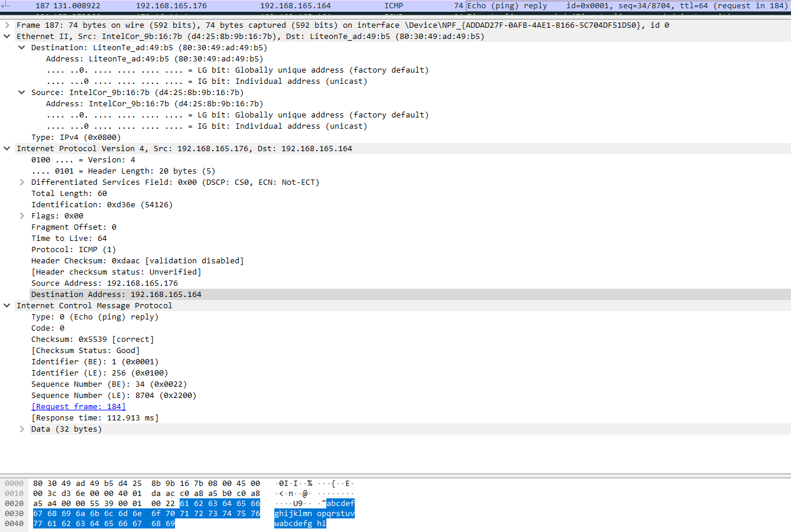

为方便对比，同时在Receiver抓取了echo reply报文

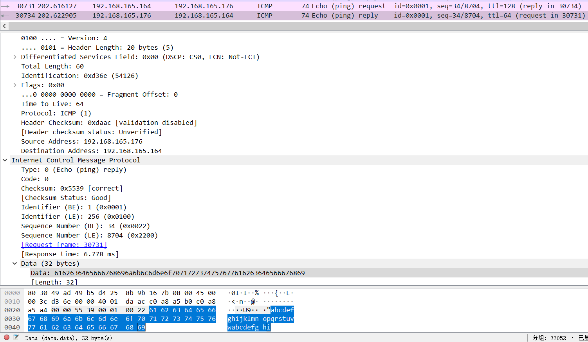


（2）运行结果分析

1.对于Receiver，通过对比程序和wireshark的抓包和解析结果，可以看到二者完全一致。同时，报文中源主机IP192.168.165.164（c0 a8 a5 a4），目的主机IP192.168.165.176（c0 a8 a5 b0），ICMP类型字段为8（echo request），数据部分为abcdefghijklmnopqrstuvwabcdefghi。与Sender发出的报文也是一致的。

此外也能从截图中看到，Receiver向Sender自动回复了一个echo reply报文。

2.对于Sender，能通过wireshark抓取到Receiver发送的echo reply报文。可以对比Receiver自动回复的报文与Sender接收到的报文，发现两者也是一致的。例如报文中的几个关键字段：源主机IP192.168.165.176（c0 a8 a5 b0），目的主机IP192.168.165.164（c0 a8 a5 a4），ICMP类型字段为1（echo reply），数据部分为abcdefghijklmnopqrstuvwabcdefghi。


（3）实验结论

本实验中使用WinPcap技术，根据ICMP协议数据单元的结构和封装规则，封装数据帧发送到局域网中；同时捕获网络中的ICMP数据包，解析数据包的内容，并显示结果，同时写入日志文件。  通过将书本上抽象的概念与具体实现技术结合，通过网络软件编程的实践，深入理解理论课上学习到的计算机网络基本原理和重要协议，通过自己动手编程封装与发送数据分组，加深对网络协议的理解，掌握协议数据单元的结构和协议工作原理及其对协议栈的贡献。实验中需要注意，数据包的封装发送和解析都必须严格遵守协议规定。网络协议栈的多种协议都有自己的功能，协议包括语义、语法和同步三个要素，不同的网络协议其分组的首部格式不同，必须按照协议规定的格式封装（发送）和理解（接收）数据分组首部，才能使得不同站点的计算机按照规定的方式相互通信。


（4）讨论

我们选择发送和解析ICMP报文以模拟ping命令的实现，但对于我们的程序还存在一个问题：ping命令只需要用户输入目的设备的IP，但我们的程序需要源、目的设备IP和MAC地址。为了改进这一问题，可以从两方面入手：一是获取设备适配器列表同时解析适配器的IP，这样就不再需要源设备IP；二是使用ARP报文或尝试访问ARP cache，从而自动获取目的设备（同一局域网下ping）或默认网络（跨网络ping）的MAC地址。

**重要程序代码：**

ICMP、IP、以太网帧结构体定义：

```c++
//IP地址
typedef struct ip_address {
	unsigned char byte1, byte2, byte3, byte4;
} ip_address;

//IP报文首部
typedef struct ip_header {
	unsigned int version_head_len : 8;	//版本_首部长(4B为单位)
	unsigned int tos : 8;				//服务
	unsigned int len : 16;				//IP报文总长(1B为单位)
	unsigned int identification : 16;	//标识
	unsigned int flag_offset : 16;		//标志_片偏移
	unsigned int ttl : 8;				//生存时间
	unsigned int proto : 8;				//协议，ICMP为1
	unsigned int checksum : 16;			//首部校验和
	ip_address saddr;					//源IP
	ip_address daddr;					//目的IP
} ip_header;

//ICMP报文首部
typedef struct icmp_header {
	unsigned int type_code : 16;		//类型，request为8
	unsigned int checksum : 16;			//首部校验和
	unsigned int id : 16;				//
	unsigned int serial : 16;			//
} icmp_header;

//MAC地址
typedef struct mac_addr {
	unsigned char byte1, byte2, byte3, byte4, byte5, byte6;
} mac_addr;

//以太网帧头
typedef struct ethernet_header {
	mac_addr dmac;						//目的MAC
	mac_addr smac;						//源MAC
	unsigned int type : 16;				//封装协议类型，IP为0x0800
} ethernet_header;
```


**题目2：简单远程程序调用**

（1）需求分析

a）基本需求分析

实现一个C/S应用，需要设计Client端应用和Server端应用，Client端需要能够接收用户的命令，然后将命令发送至服务器端；Server端需要能够接受Client发送来的命令，并且执行这些命令获得返回结果，并将结果发送给Client端。Client端为了接收用户命令，需要有个简单的Terminal用于输入指令。考虑到应用程序的通用性和普适性，Client端采用Java语言编写，因此可以实现跨平台，运行于任何操作系统；Server端采用C++编写，运行于Linux操作系统。

b）扩展实现分析

在基本需求实现的前提下，可以通过自己设计一个Server端运行的程序，Client端通过Server对该程序进行控制，从而实现一些特殊的功能。在我们的设计中，我们计划实现一个云端FPGA模拟器，用户可以发送Verilog文件交由模拟器执行，同时用户可以通过一些可视化的方式，与FPGA模拟器进行交互。为了实现这部分功能，需要完成以下几个部分：定义模拟器与Client交互的控制字格式，实现文件的上传功能，为Client端实现一个图形化界面。

（2）设计方案

a）设计思路

整个程序的处理内容事实上可以归纳为对数据和指令的处理。对于FPGA模拟器的控制事实上也是通过一些Server端自定义的命令来实现的。Server与Client约定了某些特殊命令，当Client端有相应的事件触发时，就会向Server端发送对应的保留命令，从而使Server端进入对应的处理状态。需要发送的数据主要包括一般命令数据和FPGA模拟器数据。对FPGA模拟器的实现，本质上是C/S两端对于FPGA模拟器状态数据的修改和同步：C/S两端各自维护一个自己的FPGA状态，当一端的状态因为用户事件或是模拟器计算发生改变时，就会向另一端发送数据以同步两端的状态。

Client与Server端的交互采用Socket通信。为了统一各种数据的传输协议，我们对Client与Server端有一个基本的约定：Client端每进行一次发送，就需要收到一个响应；Server端每进行一次接收，必须返回一个结果。为了维持服务端与客户端数据和命令的控制关系，我们采用阻塞IO的方式，确保服务端和客户端的行为满足时序约束。但是阻塞IO会带来一个问题：当传输多行数据时，数据接收方如何得知数据已经接收完毕？我们的解决方案是数据发送方在发送完全部数据后，紧接着发送一个事先约定好的结束符（见<u>*整体架构*</u>部分）。接收方收到结束符，就知道没有更多数据需要接收了，便可以退出阻塞IO。

b）整体架构

整个程序整体上由客户端和服务器端两大部分构成。客户端可以划分为GUI和Client两个部分。服务器端可以划分为Server和Vmodel（Virtual FPGA Model）两个部分。其大致关系如下图所示：

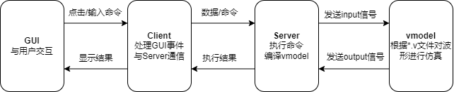


前端的GUI主要负责处理用户对于FPGA模拟器的操作，将其转化为数据交给Client进行数据处理或发送；同时GUI会根据Client提供的数据更新当前的显示状态。为了满足模拟一块真实的FPGA开发板的需要，GUI中实现了16个LED灯，2个数码管，16个拨码开关，以及1个复位按钮。除此之外，GUI中还提供了：运行按钮，用于控制FPGA模拟器的启动与关闭；上传按钮，用于发送用户指定Verilog文件；Terminal按钮，用于开启命令行交互。


GUI的实现采用了Swing来实现，在整个Client程序运行之初，会先利用Swing库中的相关API绘制图形化界面，在界面上绘制各类按钮，开关，LED灯等元素，并为可交互的组件如各类按钮加入事件监听器，当事件触发时，便调用相应的函数，执行相应的命令。

Client单元一方面负责命令、数据的处理和发送，另一方面也负责接受Server端的数据接收与解析。Client处理的命令是多样的，命令的来源包括GUI上的一些按键，也包括terminal的输入。对于命令，由于命令往往是多行的，Client会选择直接调用Java Socket接口函数将命令发送至Server端。当Client需要发送多行数据时，例如上传文件，为了标识数据流的终结，需要发送一个“EREQ”的终结标识符。对于多行输入来说，一个EREQ标识着一次发送的结束。

服务器端的Server部分，首先需要负责监听客户端的请求，每建立一个连接，就开启一个新的线程去处理该连接的请求。当前最多支持五个客户端同时访问。其次，线程处理函数对Client发送来的请求进行解析，然后转发至响应的处理程序。对于普通bash命令，服务器端会调用bash来执行该命令获取结果，对于我们约定的启动fpga的命令，则会通过创建新进程的方式调用服务器端编译的FPGA模拟器。上传文件只需要单纯的文件读取，所以不需要采用多线程或多进程的方式进行处理。Server端向Client写回数据同样也需要考虑数据的格式，单行数据来说，只需要直接发送即可。对于多行数据，同样需要为指定一个结束标识符，也就是ERESP。

模拟器Vmodel的部分采用了开源模拟器Verilator，这是一款针对System Verilog HDL的模拟器，可以将System Verilog的代码编译成C++文件，通过与我们写好的C++文件（称为激励产生模块文件）共同编译链接，就可以形成一个可交互的FPGA模型Vmodel。激励产生模块一方面通过对Verilator 模型的输入输出状态进行写入和读取，仿真程序的状态;另一方面，激励产生模块还需要与Server程序进行进程间通信（IPC），进程间通信采用Linux的系统调用，通过两个有名管道在Server端进行数据交换。

（3）程序结构和流程图

整体流程：

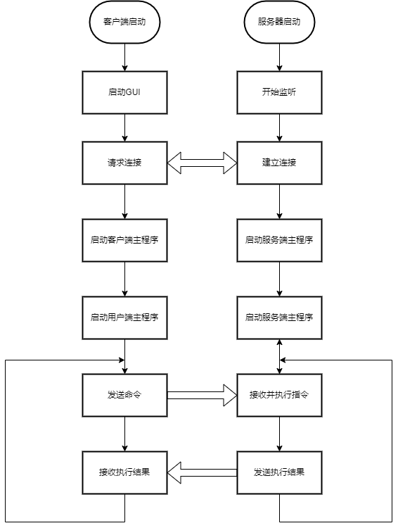

程序运行开始前，客户端和服务器端分别启动。从时序上看，服务器端会先启动，创建Socket，开始监听有无连接请求。客户端启动后，会首先调用Java Swing库绘制GUI，然后会像服务器端发送连接请求，此时正在监听的服务器端接受到请求，便会开启一个新的线程，用于执行该客户端的命令。此后，客户端不断向服务端发送命令，每一个完整的发送都会有一个完整的回复。客户端根据服务器端所返回的内容显示命令执行结果或更新GUI状态。服务端根据客户端命令进入特定的执行程序做进一步处理，或是直接将命令的执行结果返回给客户端。

服务端和客户端为了处理不同的命令，在不同的场景有着不同的状态，通过发送不同命令会让应用进入不同的状态。不同状态之间的状态转换图如下所示。

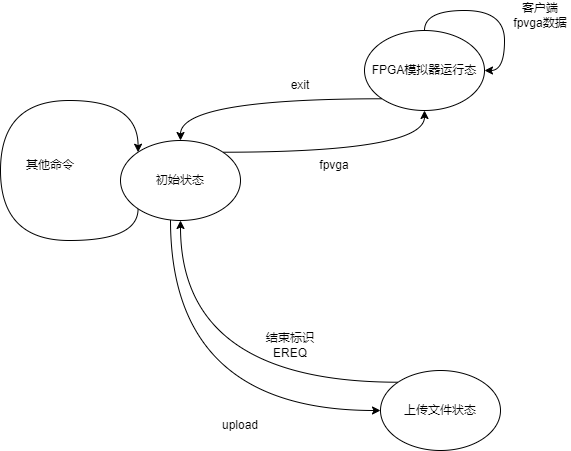

a) 连接建立

服务器端启动后，首先调用Linux的系统调用socket函数，通过该函数创建Socket描述符，创建Socket描述符时需要指定domain，type和protocol。其中domain标志了一个通信域，通过domain参数可以选择需要的通信协议族，这些协议族被定义在\<sys/socket.h\>中，各个协议族的名称都以AF作为前缀，意指address family。不同的域之间表示地址的格式各不相同，但都会被抽象成一个统一的结构体sock_addr，本项目选择的协议族为AF_INET，即IPv4通信域。type参数表示Socket的类型，当前定义了`SOCK_STREAM`, `SOCK_DGRAM`, `SOCK_SEQPACKET`, `SOCK_RAW`, `SOCK_RDM`等，本项目选择的是其中的`SOCK_STREAM`，该种套接字，提供有序，可靠，双向，面向连接的字节流（ Provides  sequenced,  reliable,  two-way,  connection-based byte streams.——Linux Programmer's Manual）,由于该模式提供的是字节流服务，因此应用程序无法识别出发送的边界，也无法确定是否在一次调用就可以获得全部的数据。因此本项目在使用时约定了自己的协议，用于划分传输边界。Protocol参数指定了需要使用的特定协议，本项目采用了IPPROTO_TCP，也就是TCP协议。

为了让客户端有一种手段发现连接服务器所需要的地址，服务器需要保留一个地址并将其注册在/etc/services中或是某个名字服务中，这个过程中需要利用bind函数完成，如前所说，不同通信域的地址都被转换成sock_addr处理。对于IPv4协议，其事实上使用了结构体sock_addr_in，该结构体包括协议族，端口号，IPv4地址三个域构成。需要指出的是，在服务器端。此项目采用了INADDR_ANY作为IPv4地址，这表示程序会接收这个系统所安装的任意一个网卡的数据包。

完成绑定后，服务器端会调用listen函数，该函数的其中一个参数backlog指定了了要入队的未完成连接数量，当队列满时，则系统会拒绝多余的请求。在使用listen函数之后，就可以通过调用accept函数获得连接请求并建立连接，accept函数会返回一个新的套接字，该套接字与原始的套接字拥有相同的套接字类型和地址族，服务器会利用这个套接字，处理客户端发送的请求，并且向客户端返回结果。

客户端采用Java实现，在连接建立这个部分比较简单，Java程序通过调用net.Socket包中的Socket类，在创建Socket对象时，需要指定host和port，即主机名称和端口号。通过此种方式，客户端与服务端建立一个连接，客户端将Socket对象的输出流和输入流分别定向到一个PrintWriter和BufferReader，通过这种方式读取和发送数据。

当服务器端和客户端完成连接建立后，服务器和客户端会在各自的终端中输出连接成功的信息，然后服务器端进入等待客户端命令的状态。此时进入初始状态。

b) 初始状态

当执行terminal功能时，程序会持续运行在初始状态，其工作流程图如下：

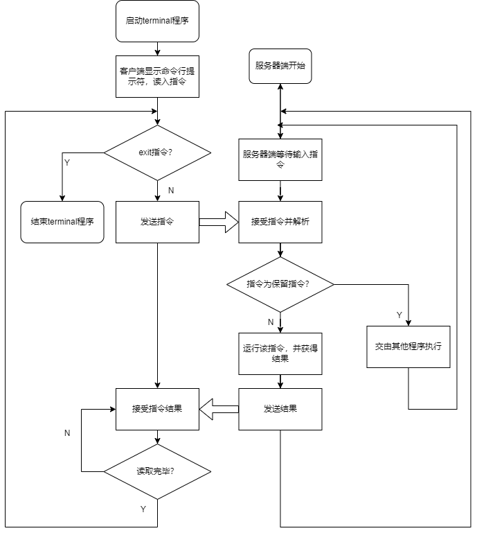

从客户端的视角出发，首先客户端需要按下Open terminal按钮才能进入命令行模式，需要指出，按下Open terminal按钮并不会改变程序的运行状态，只是会弹出一个命令提示符，对于服务器端来说，接下来用户发送的命令与程序中的保留命令在解析的过程中并没有区别。用户可以在客户端可以输入Shell命令。当按下回车之时，客户端程序会读取这一行命令，发送给服务器端，然后从服务器端获得结果并输出，命令的输出往往无法确定其输出内容的长度，此处采用了字节流的方式，如前所述，此种方式无法明确传输的边界，所有我们采用了自定义的结束符 ERESP，代表全部的结果都已经发送完毕。

从服务器的视角上看，在初始状态，程序在一个称为socket_handler的函数中无限循环，循环体主要是对命令进行解析，然后将其分发到不同的处理程序。当接收到一条指令时，首先服务器会对命令进行解析，如果是保留指令，例如`fpvga`,（进入FPGA模拟器状态）,程序会跳转到相应的执行函数处理。对于一个普通的命令， 程序会调用process函数，该函数采用了Linux系统调用popen创建一个子进程，执行用户发送的命令，并通过管道将该进程的执行结果取回，由于结果的长度不定，程序会不断的读取结果的内容，直至遇到文件结束标识符eof，然后将全部的内容发送给客户端，当文件主体内容末尾，服务器会补上一个ERESP的标识，代表结果发送完毕。

当用户输入exit指令时，客户端读取该指令，不再输出提示符，关闭Terminal功能，该指令不需要发送给服务器端。

c）上传文件状态

在程序运行在初始状态是，如果用户在客户端按下了上传文件按钮，就相当于在Terminal中输入一条`upload`指令，客户端会弹出文件选择界面，文件选择器会过滤出所有的Verilog文件。然后客户端会进入上传文件状态，首先客户端将上传命令发给服务器端，然后客户端等待服务器端的响应，当客户端接受到服务器端的回应后，会开始运行上传程序，上传程序的内容主要是不断地读取文件内容，并且向服务器端程序发送文件内容，当文件发送完毕后，程序会在最后一行补上EREQ标识，代表发送完毕。然后程序等待服务器地响应，确认发送成功后，程序会发送编译命令，要求服务器端将刚才上传地Verilog文件通过服务器端的Verilator程序编译成可以执行的Verilog模型。客户端读取Verilog文件编译结果，如果发现错误，则会禁用FPGA的运行按钮。因为此时没有可执行的Verilog模型，无法运行，需要用户上传一个正确的可用的Verilog文件才能继续运行程序。

当服务器端接受到客户端发送的upload命令时，socket_handler会调用file_receive函数，当程序在upload函数中运行时，程序即处于上传文件状态，当服务器端进入上传文件状态前，会首先向客户端回复一个“upload start”, 然后运行file_receive函数。在这个函数中，程序不断读取客户端发送的文件，并将该文件的内容写入当前工作路径下的`top.v`文件当中。当收到结束标识符"EREQ"时，程序完成写入，关闭文件流，然后向客户端发送发送成功的标识。然后退出上传文件状态。回到初始状态，然后紧接着处理程序发送的编译命令。对于服务器来说，编译命令的输入与一般的shell命令无异。

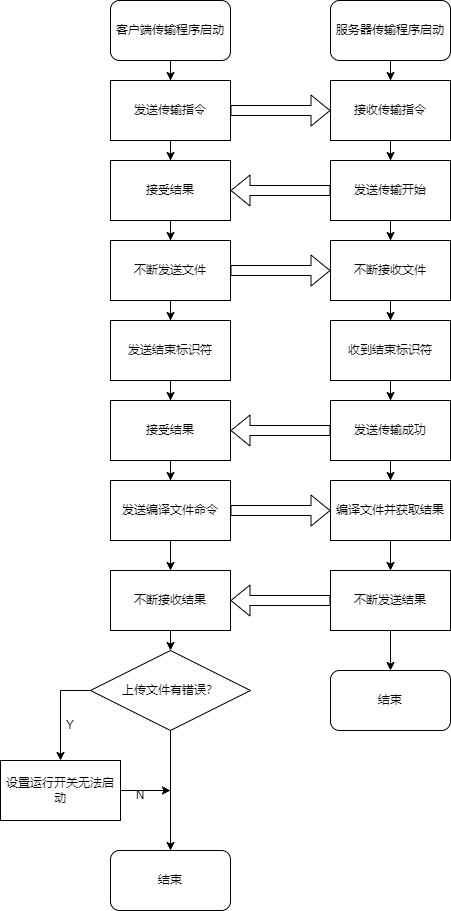

d) FPGA模拟器状态

如前文所述，FPGA模拟器事实上是交换服务器端和客户端保存的FPGA状态的数据。

当用户按下Run按钮时，客户端会向服务器发送`fpvga`命令。当客户端接受到服务端的响应后，会开启一个子线程，该线程以固定时间间隔扫描开关状态，并向服务器端发送开关信号和时钟信号。服务器端的每次发送内容为一个长度为18字节的报文，按字节序从前到后分别是时钟信号，复位信号，16位开关信号。每次数据发送会收到一组长度为32字节的数据，每个字节代表一个LED灯或一段数码管的状态，客户端会根据返回到的状态更新GUI上的状态显示。客户端发送的信号中，比较特殊的是Reset信号和时钟信号。为了设计的简化，时钟信号由客户端提供，两次发送构成一个时钟周期，每次发送时钟翻转一次。由于数据发送都是在时钟沿的变化处进行发送，此处的Reset的信号也是同步复位信号，采用Click事件带来的时序问题会变得难以处理，因此Reset按钮采用了Press和Release这对事件，当鼠标按住开关时，Reset信号置0（此处采用的是低电平复位）。

当服务器端收到用户发送的`fpvga`，服务器端将进入FPGA模拟器状态。服务器端首先会向客户端发送FPVGA模拟器启动成功，然后开启多进程模式，启动Verilog模型作为子进程。父进程首先先确定是否有管道存在，如果没有，则创建两个有名管道用于进程间通信。然后父进程等待客户端发送FPGA状态信息，当接受到FPGA状态信号时，父进程将信息通过写入发送数据管道，子进程读取该信息，并更新FPGA状态，调用Verilator内置API进行仿真，更新对应的输出状态。然后子进程将这部分状态写入接收管道，父进程从接收管道中读取结果，并发送给客户端。

客户端程序每次发送前会检查运行开关是否处于运行态，当开关不属于运行态时，客户端会向服务器端发送结束标识符EREQ，客户端会受到服务器端的回复，标识FPGA模拟器已经停止运行。当服务器端收到结束指令后，服务器端会向子进程发送结束命令，只有当子进程成功结束后，服务器程序才会退出FPGA模拟器状态。


（4）测试方案

a) 连接测试

首先测试在服务器端没有连接时的状态，然后验证在建立连接时的服务器行为和客户机行为。除此以外还要验证多个客户端同时连接，以及单个客户端反复连接。

b) 测试Terminal模式

Terminal程序的服务器端采用的是将流重定向的方式，Linux系统的标准输入输出流有`stdin`, `stdout`,` stderr`, 所以需要分别测试`stdout`和`stderr`两种不同的输出流的状态。除此之外，用户可能会输入不存在的指令，需要检测是否会向用户返回提示信息。

1. 测试`stdout`

   大多数的指令的输出内容都是`stdout`，这里选取两条与网络相关的指令`ifconfig`，`ping`。

2. 测试`stderr`

   gcc的版本信息是通过stderr输出的，所以可以通过`gcc`命令来验证`stderr`流。

3. 测试错误指令

   这里随意输入一条不存在的指令即可。

c) 测试上传文件

1. 上传正确文件

   上传一个正确的Verilog文件即可。

2. 上传错误文件

   上传一个带有语法错误的Verilog文件，查看GUI的提示信息和命令行返回的错误提示

d) 测试FPGA模拟器

1. 测试组合逻辑电路

   即时钟在这个过程中无法发挥作用

2. 测试时序逻辑电路

   测试数码管的显示和LED模块的显示。

**实验数据：**

a) 连接测试

直接启动服务端和客户端程序即可

b) 测试Terminal模式

```shell
#测试stdout
$ ifconfig
$ ping 192.168.88.1 -c4 #192.168.88.1为主机网卡的地址
```
预计输出服务器端的网卡信息和服务器端ping客户端的结果

```shell
#测试stderr
$ gcc -v
```
输出服务器端的gcc版本号

```shell
#测试非法指令
$ ustb
```
返回指令错误

c) 上传文件与测试FPGA模拟器的文件

文件一：测试组合逻辑——直接相连

```verilog
module connet(
    input clk,
    input rst,
    input [15:0] sw,
    output [15:0] led,
    output [15:0] seg
);
    assign led = sw;
endmodule
```

预期结果——文件上传成功，程序正常执行

文件二：错误文件，返回Verilog语法错误

```verilog
module connet(
    input clk,
    input rst,
    input [15:0] sw,
    output [15:0] led,
    output [15:0] seg
);
    assign led = sw;
    assign rst
endmodule
```

预计结果——编译错误，无法继续运行

文件三：测试时序逻辑

```verilog
module light(
    input clk,
    input rst,
    input [15:0] sw,
    output [15:0] led,
    output [15:0] seg
);
    assign led = 0;
    reg [3:0]num;
    reg [4:0]count;
    always @(posedge clk)begin
        if(!rst)
            count <= 0;
        else
            count <= count + 1;
    end 
    always @(posedge clk)begin
        if (!rst)
            num <= 0;
        else if (count == 0)
            if (sw[0] == 1'b1)//当开关拨上时，减量计数，开关拨下时，增量计数
            	num <= num - 1;
        	else 
            	num <= num + 1;
    end
    wire [7:0]seg1,seg2;

    decode d1(num,seg1);
    decode d2(num,seg2);
    assign seg = {seg1,seg2};

    onehot o1(num,led);
endmodule

module decode(
    input [3:0]num,
    output [7:0]seg
);
        assign seg =(num == 4'd0) ? 8'b1111_1100:
                    (num == 4'd1) ? 8'b0110_0000:
                    (num == 4'd2) ? 8'b1101_1010:
                    (num == 4'd3) ? 8'b1111_0010:
                    (num == 4'd4) ? 8'b0110_0110:
                    (num == 4'd5) ? 8'b1011_0110:
                    (num == 4'd6) ? 8'b1011_1110:
                    (num == 4'd7) ? 8'b1110_0000:
                    (num == 4'd8) ? 8'b1111_1110:
                    (num == 4'd9) ? 8'b1111_0110:
                    (num == 4'ha) ? 8'b1110_1110:
                    (num == 4'hb) ? 8'b0011_1110:
                    (num == 4'hc) ? 8'b1001_1100:
                    (num == 4'hd) ? 8'b0111_1010:
                    (num == 4'he) ? 8'b1001_1110:
                    (num == 4'hf) ? 8'b1000_1110:
                                                8'b0000_0000;
endmodule
module onehot(
    input   [3:0] num,
    output  [15:0]led
);
    assign led = 16'b1 << num;
endmodule
```

模拟器可以增量计数和减量计数，可通过开关控制

**实验结果与分析：**

（1）程序运行结果

a）连接测试

当服务器启动时，此时未连接任何客户端：


成功连接时，服务器端显示：


客户端显示


客户端关闭窗口会断开连接，服务器端显示：


当再次启动客户端程序，服务器端显示：


同时在客户端机器上再运行一个实例，可以看到新的实例也连接到了服务器：


两个客户端程序都可以工作


b) terminal测试

ifconfig指令


ping指令


gcc -v指令


ustb (并不存在的指令)


c) 上传并运行文件

1. 文件一

   

   

      

2. 文件二


3. 文件三

   

   

   

   

（2）运行结果分析

a)  连接测试

 从实验结果可以看到，当未连接任何设备时，不会输出内容，当建立连接时，服务器端会显示连接来源的IP地址和端口号，当客户端关闭窗口时，会像服务器发送shutdown指令。服务器会打印一个exit代表成功退出，exit不发回客户端。

关闭客户端以后，可以重新运行客户端，同样可以建立连接。服务器端可以连接多个客户端，从结果来看，有两个实例同时连接到了服务器，可以通过端口号进行区分，由于两个实例都在同一台计算机上运行，因此IP地址相同。

b) Terminal 测试

1. `stdout`命令

   可以看到，客户端上正确的输出了结果，ifconfig指令输出来服务器端的ip地址等信息。ping主机的命令也可以执行

2. `stderr`命令

   可以看到，gcc -v命令输出了gcc的版本信息

3. 错误命令

   可以看到，对于不存在的非法指令，程序会返回错误提示。

c) 文件上传及执行测试

1. 文件一——开关与LED灯直接相连

文件一证明了程序支持多个实例同时运行,程序首先向服务器端发送了upload命令，收到了服务器发送回的"upload start", 然后将文件内容不断发送至服务器端，当文件发送完毕，收到了客户端发送的upload success，然后客户端发送了编译命令，并取回了编译结果，由于编译结果是正确的，所以程序得以正确执行，从结果可以看到，当开关拨上时对应的LED灯也会亮，与预期一致。

2. 文件二——带有语法错误

   从图中可以看到，程序返回了错误信息，同时GUI上的运行按钮变为灰色，无法运行。

3. 文件三——倒计时与流水灯

   从图中可以看到，程序正确运行，在开关拨下时，计数器增量计数，LED灯亮的位置与计数器示数对应，当开关拨上时，计数器减量计数。可以看到程序也能够处理时序逻辑。

   

   图中可以看到每次客户端向服务器端发送的数据报文，其中第一位是时钟信号，可以看到图中的信号中该位不断跳变，后面一位是Reset信号，由于该部分低电平使能，所以此时保持高位。后面的16位代表开关状态，可以看到最后一位开关拨上，下面一行是收到的LED和数码管状态。代表了数码管和LED被点亮的位由于数据发送过程极快，服务器端的FPGA程序对时钟信号进行了分频，因此图中返回的fpga状态都没有发生变化。

（3）实验结论

在本次实验中，我们体会了不同操作系统（Windows 和Linux），不同编程语言编写的程序之间通过socket计数进行通信的过程，对于计算机网络连接异构计算机进行通信的作用有了更深的理解，此次实验中，我们完成了一个简单的web应用，并提供了丰富的手段去操作web程序，包括命令行与图形界面。同时，我们还采用简易的手段，实现了文件传输和远程控制的功能，对于应用层部分软件的实现方式有了一定的理解。

（4）讨论

1. 当前的远程控制程序暴露了过多的权限给用户，在安全性上有着较大的缺陷，远程用户可以执行大多数shell程序，同时对连接没有验证，因此安全性上较为堪忧。后续可以针对这一点做出改进。

2. 当前的协议选用的结束标识符并不是特别恰当，虽然正常情况下很难出现该操作符，但当前无法做到真正的透明传输。

**重要程序代码：**

连接建立,主函数：

```cpp
/**
* @brief 
*  main function is used to make connection between server 
*  and client
*/
int main()
{
	// definition
	in_port_t ip = htons(PORT_ID);
	sockaddr_in serv_addr;
	sockaddr_in client_addr;
	pthread_t pt;
	// operation
	cout << "==================init =========================\n\n\n";
	int serv_sock = socket(AF_INET, SOCK_STREAM, IPPROTO_TCP);
	if (serv_sock < 0)
	{
		cout << "error when creating the socket";
		return 0;
	}

	serv_addr.sin_family = AF_INET;
	serv_addr.sin_port = ip;
	serv_addr.sin_addr.s_addr = htonl(INADDR_ANY);

	int res = bind(serv_sock, (sockaddr *)&serv_addr, sizeof(sockaddr_in));
	if (res < 0)
	{
		cout << "error when bind the socket";
	}

	res = listen(serv_sock, 5);
	socklen_t socklen = sizeof(sockaddr);
	while(true){
	int tcp_conn = accept(serv_sock, (sockaddr *)&client_addr, &socklen);
	printf("Connection from :%s:%d\n", inet_ntoa(client_addr.sin_addr),client_addr.sin_port);
	pthread_create(&pt, NULL, socket_handler, &tcp_conn);
	}
	// socket_handler(&tcp_conn);

	void *useless;
	pthread_join(pt, &useless);
	close(serv_sock);
	return 0;
}
```

根据发送指令内容将指令分发到各个处理程序。

```c++
/**
 * @brief 
 * 	the main function for the server ,receive the instrution from the
 * 	client, and choose different function according to the operation 
 * 	field
 * @param p
 * 	the pointer point to the socket id 
 * @return void* 
 * 	return nothing
 */
void *socket_handler(void *p)
{
	int sock = *(int *)p;
	printf("Welcome to Server\n");
	sprintf(buf_send, "Welcome to Server");
	char op[OP_SIZE];
	while (true)
	{
		memset(buf_recv, 0, BUF_SIZE * sizeof(char));
		printf("Ready to recv\n");
		recv(sock, buf_recv, BUF_SIZE - 1, 0);
		sscanf(buf_recv, "%s", op);
		printf("op:%s\n", op);
		if (strcmp(op, "shutdown") == 0)
		{
			printf("exit\n");
			break;
		}
		else if (strcmp(op, "fpvga") == 0)
		{
			printf("fpvga launching\n");
			sprintf(buf_send, "fpvga enable\n");
			send(sock, buf_send, strlen(buf_send), 0);
			fpvga_interface(sock);
		} else if (strcmp(op,"upload")==0){
			sprintf(buf_send, "upload start\n");
			send(sock, buf_send, strlen(buf_send), 0);
			file_recieve(sock);
		}
		else
		{
			printf("command:%s %s\n", op, buf_recv);
			memset(buf_cmd, 0, BUF_SIZE);
			sprintf(buf_cmd, "%s 2>&1", buf_recv);
			string res = process(buf_cmd);
			printf("in function socket handler:\nres=%s\n", res.c_str());
			send(sock, res.c_str(), res.size(), 0);
			// send(sock,buf_recv,strlen(buf_recv),0);
		}
	}
	close(sock);
	return NULL;
}
```

FPGA模拟器父进程代码

```c++
/**
 * @brief 
 * 	this function use to receive data from client, write it to fifo,
 *  and get result from virtual fpga model
 * @param pid 
 *  the pid is used by function wait();
 * @param sock 
 * 	the sockid associated to the client
 * @return int
 * 	return 0 after child process exit  
 */
int father_process(int pid, int sock)
{
	while (true)
	{
		printf("open fd_write\n");
		memset(buf_recv,0,BUF_SIZE);
		// reset the buf_recv
		recv(sock,buf_recv,BUF_SIZE,0);
		// receive data from clients
		printf("recieve data: %s\n",buf_recv);
		int fd_write = open(fifo_stov, O_WRONLY, 0); // pipe fd = file describer
		if (fd_write == -1)
		{
			cerr << "Server : error occuried when open fifo write\n";
			exit(-1);
		}
		write(fd_write, buf_recv,FIFO_SEND_SIZE);
		//write data or command to server
		close(fd_write);
		if (strncmp(buf_recv, "EREQ", 4) == 0)
			break;
		
		// if client send EREQ,the infinite loop will end
		// the child process need to know that the EREQ has been sent
		// but the server no need to read from vmodel

		int fd_read = open(fifo_vtos, O_RDONLY, 0);

		if (fd_read == -1)
		{
			cerr << "Server : error occuried when open fifo\n";
			exit(-1);
		}
		read(fd_read, buf_send,FIFO_RECV_SIZE);
		//read data from vmodel and send it back to server
		close(fd_read);
		buf_send[32] = '\n';
		printf("get result:[%s]\nENDENDEND\n",buf_send);
		send(sock,buf_send,strlen(buf_send),0);
	}
	int status;
	wait(&status);
	//wait for the child process ends
	sprintf(buf_send,"fpvga exit\n");
	send(sock,buf_send,strlen(buf_send),0);
	//send corresponding response to client
	return 0;
}
```

FPGA模拟器代码——主函数

```cpp
int main(){
	(void)freopen("test.out","w",stdout);
    //redirect the output stream to test.out, the type case is used to eliminate the warning of unused return value
	printf("first line\n");
	fpvga_init();
	printf("done with init\n");
	while(fpvga_get_data()){
		printf("get data success!\n");
		fpvga_single();
		fpvga_send_data();
	}
	fpvga_clear();
	return 0;
}
```

Terminal 模式

```c++
/**
 * @brief 
 * 	process the normal shell command
 * @param cmd 
 * 	the pointer point to the cmd from clients
 * @return string 
 * return the result of the command
 */
string process(char *cmd)
{
	memset(buf_send, 0, BUF_SIZE * sizeof(char));
	FILE *fp;
	string res;
	printf("in process :cmd =[%s]\n", cmd);
	fp = popen(cmd, "r");
	while (feof(fp) == 0)
	{
		memset(buf_res, 0, BUF_SIZE * sizeof(char));
		fread(buf_res, 1, BUF_SIZE - 1, fp);
		printf("in function process:buf_res=%s\n", buf_res);
		res.append(buf_res);
	}
	res.append("ERESP\n");
	printf("buffer_recv:%s\nbuffer_send%s\n", buf_recv, buf_send);
	pclose(fp);
	printf("live so far\n");
	return res;
}
```

FPGA模拟器代码——仿真

```c++
void fpvga_single(){
	printf("single test\n");
    // give the input
    top->sw = sw;
    top->clk = clk;
    top->rst = rst;
    top->eval();//use the verilator API to simulate
    // get the output
    led = top->led;
    seg = top->seg;
    printf("In this test,sw=%d,led=%d,seg=%d\n",sw,led);
}
```

FPGA模拟器代码——获取数据

```c++
bool fpvga_get_data(){
	memset(buf_recv,0,BUFF_SIZE*sizeof(char));
	//recv(sock,buf_recv,BUFF_SIZE-1,0);
	printf("verilator:getting the data\n");
	fd_read = open(fifo_stov,O_RDONLY);
	read(fd_read,buf_recv,FIFO_SEND_SIZE);
	//read the input data from named pipe
	close(fd_read);
	if (strncmp(buf_recv,"EREQ",4) == 0){
		// EREQ : standard exit command from client
		// when this signal shows up, the fpvga will exit
		return false;		
	}
	sw = 0;
	clk = buf_recv[0] - '0';
	rst = buf_recv[1] - '0';
	// get the clk and the rst
	char * queue = buf_recv + 2;
	
	for(int i=0;i<SW_NUM;i++){
		sw += ((queue[i] - '0') << (SW_NUM-i-1));
	}
	return true;
	//no need for exiting the program,return ture
}
```

